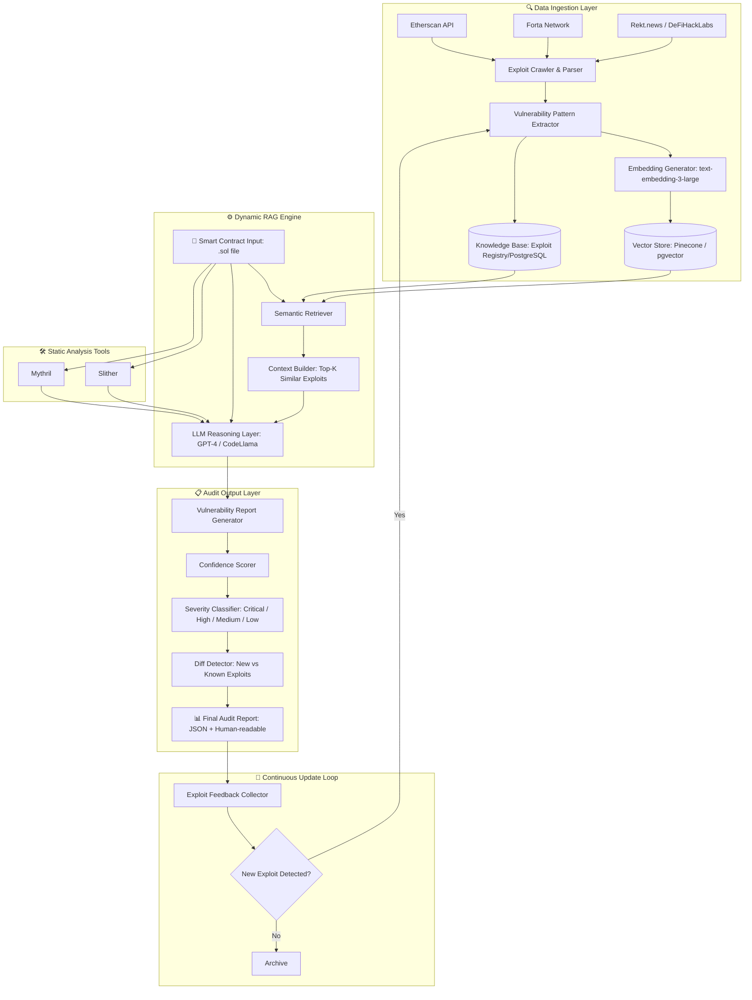
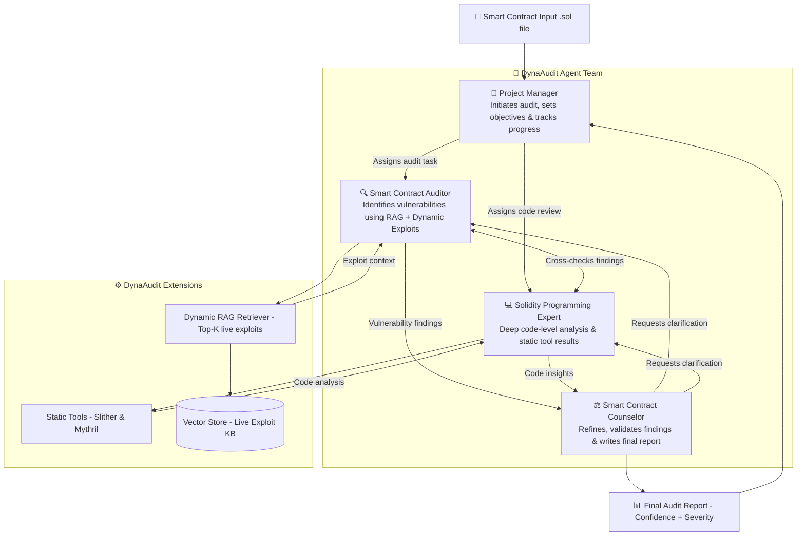

# DynaAudit

> **DynaAudit: Exploit-Driven Dynamic RAG for Emerging Smart Contract Vulnerability Detection**
>
> Extending [LLM-SmartAudit](https://ieeexplore.ieee.org/document/11121619) (IEEE Transactions on Software Engineering, 2025) with Continuous On-Chain Threat Intelligence

[
[
[
[

***

## Overview

DynaAudit is a multi-agent smart contract auditing system that addresses a critical gap in existing LLM-based auditing tools: **static knowledge bases cannot detect emerging vulnerabilities from exploits that occur after model training cutoffs.**

### The Problem

- Smart contracts on Ethereum are immutable once deployed — bugs cannot be patched post-deployment
- Over $2.6 billion USD was lost across 192 smart contract exploit incidents in 2024 alone
- Existing LLM-based audit tools (including LLM-SmartAudit) rely on static training data and cannot reason about new exploit patterns discovered after their training cutoff
- A single LLM auditor suffers from **degeneration-of-thought** — it becomes increasingly biased toward its initial analysis and misses vulnerabilities

### The Solution

DynaAudit combines two innovations:

1. **Multi-Agent Collaboration** — Four specialized AI agents modeled on a real-world audit firm, each challenging the others' findings to prevent degeneration-of-thought
2. **Dynamic RAG** — A continuously updated knowledge base ingesting live on-chain exploits from Etherscan, Forta, and DeFiHackLabs, injected into agent context at audit time

***

## Architecture

### 1. Data Ingestion & Dynamic RAG Pipeline



### 2. Multi-Agent Audit Team



***

## How It Works

### The Four Agents

Each agent is initialized with an **inception prompt** defining its role, scope, and communication style — preventing any single agent from dominating the analysis.

| Agent | Role | Responsibility |
|---|---|---|
| **Project Manager (PM)** | Orchestrator | Sets audit objectives, initiates subtasks, tracks progress |
| **Smart Contract Auditor (SCA)** | Primary analyst | Identifies vulnerabilities using Dynamic RAG context |
| **Solidity Programming Expert (SPE)** | Code specialist | Deep code-level analysis, integrates Slither & Mythril output |
| **Smart Contract Counselor (SCC)** | Validator & reporter | Challenges findings, deduplicates, writes the final structured report |

### The 3-Phase Audit Loop

```
Phase 1 — Contract Analysis
  PM (user) ↔ SCA (assistant)
  Goal: understand contract purpose, structure, entry points
  RAG injection: top-K similar exploits added to SCA context

Phase 2 — Vulnerability Identification
  SCA (user) ↔ SPE (assistant)   ← role reversal prevents degeneration-of-thought
  Goal: identify specific vulnerabilities from two angles
  Static tools: Slither & Mythril output fed into SPE reasoning

Phase 3 — Report Generation
  SCC validates, deduplicates, and produces the final report
  Diff Detector: flags vulnerabilities matching newly-added exploits
  not present in GPT's static training data
```

> **Key insight from LLM-SmartAudit**: The role reversal in Phase 2 — where SCA switches from assistant to user — forces SPE to independently re-evaluate findings, eliminating confirmation bias and degeneration-of-thought.

***

## Novel Contributions over LLM-SmartAudit

| Feature | LLM-SmartAudit (Baseline) | DynaAudit |
|---|---|---|
| Knowledge base | Static (training cutoff) | Dynamic — live on-chain exploits |
| Exploit sources | None | Etherscan, Forta, Rekt.news, DeFiHackLabs |
| Vulnerability detection | Known patterns only | Known + emerging (post-cutoff) |
| Confidence scoring | Binary (yes/no) | Scored with severity levels |
| Diff detection | Not present | Flags novel vs. known exploits |
| Feedback loop | None | Continuous re-ingestion of new exploits |

***

## Tech Stack

| Layer | Technology |
|---|---|
| Agent orchestration | LangChain.js |
| LLM | GPT-4o / CodeLlama |
| Backend runtime | Node.js + NestJS |
| Vector store | Pinecone or pgvector |
| Relational DB | PostgreSQL |
| Static analysis | Slither, Mythril |
| Exploit ingestion | Etherscan API, Forta Network, DeFiHackLabs |
| Embeddings | OpenAI text-embedding-3-large |
| Language | TypeScript |

***

## Project Structure

```
dynaaudit/
├── src/
│   ├── agents/
│   │   ├── projectManager.agent.ts
│   │   ├── smartContractAuditor.agent.ts
│   │   ├── solidityExpert.agent.ts
│   │   └── counselor.agent.ts
│   ├── rag/
│   │   ├── exploitCrawler.ts
│   │   ├── embeddingGenerator.ts
│   │   ├── semanticRetriever.ts
│   │   └── contextBuilder.ts
│   ├── static/
│   │   ├── slitherRunner.ts
│   │   └── mythrilRunner.ts
│   ├── pipeline/
│   │   ├── phase1.ts
│   │   ├── phase2.ts
│   │   └── phase3.ts
│   ├── output/
│   │   ├── reportGenerator.ts
│   │   ├── confidenceScorer.ts
│   │   ├── severityClassifier.ts
│   │   └── diffDetector.ts
│   └── main.ts
├── contracts/          # Sample .sol files for testing
├── reports/            # Generated audit reports
├── prisma/             # PostgreSQL schema
└── README.md
```

***

## Getting Started

### Prerequisites

- Node.js 20+
- PostgreSQL 15+
- Python 3.10+ (for Slither & Mythril)
- OpenAI API key
- Pinecone API key (or pgvector enabled in PostgreSQL)

### Installation

```bash
git clone https://github.com/YOUR_USERNAME/DynaAudit.git
cd DynaAudit
npm install
cp .env.example .env
# Fill in your API keys in .env
```

### Run an Audit

```bash
npm run audit -- --contract ./contracts/example.sol
```

***

## Background & References

This project extends the following work:

- **LLM-SmartAudit**: *Advanced Smart Contract Vulnerability Detection via LLM-Powered Multi-Agent System* — IEEE Transactions on Software Engineering, 2025. [Paper](https://ieeexplore.ieee.org/document/11121619) · [GitHub](https://github.com/LLMAudit/LLMSmartAuditTool)

***
